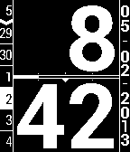

Big H
=====

Big H, watchface for Pebble smartwatch

Description
-----------

Big H is a watchface that shows the hour and minutes in big numbers, the weekday with the dates of 3 days before and after, the full date and a seconds indicator with minimal battery impact.

Features
--------

* With the release of SDK2, watchface is now configurable! (no more multiple versions)
* Hours in big numbers in the top center (12-hour & 24-hour formats)
	* No leading zero on the hour, but may be added by user-configuration
* Minutes in big numbers in the bottom center
* Weekday indicator column on the left side of the screen
	* 7 numbers shown; top slot is for Sunday, last slot is Saturday (default, user-configurable for any day in the top slot)
	* Current date is in reverse color (black on white) in the appropriate slot for its day
	* 3 days before and after the current day are shown
	* Arrow drawing indicates the break between the past 3 days and the future 3 days
	* At the user's choice, weekday names may also be displayed instead in English, French or Spanish
* Full date is written in the rightmost column
	* If watch is set to 12-hour format, the date will show as MM-DD-YYYY; otherwise, the date will be formatted as YYYY-MM-DD (default)
	* User can now specify their custom date format
* Seconds indicator is in the center, between the hour and minutes
	* Empty bar is 0 seconds
	* Full bar is 59 seconds
	* Indicators are present to indicate 15s, 30s and 45s
	* Seconds indicator only uses 2 lines so very battery efficient but still visible
	* Seconds indicator can now be turned off by user for an even more battery-efficient watchface
* If the watch is in 12-hour format:
	* AM is indicated by a small arrow pointing up over the center of the seconds bar
	* PM is indicated by the small arrow pointing down under the center of the seconds bar
* The bars around the seconds indicator show the current battery charge status (may be turned off)
* User may opt to have the watch vibrate on the hour (off by default)

Development
-----------

TODO: The configuration screen starts with the default values.  It should instead show the current values of the watchface.

TODO: The watchface forgets all settings as soon as it is updated.  (Local storage only.)  Will work to enable the watchface to retain settings through updates.  (Phone storage.)

The Roboto font was used to draw all the characters/numbers.

License
-------

Licensed under the Lesser GNU Public License version 3 (LGPLv3)
see included LICENSE file or http://www.gnu.org/copyleft/lesser.html
